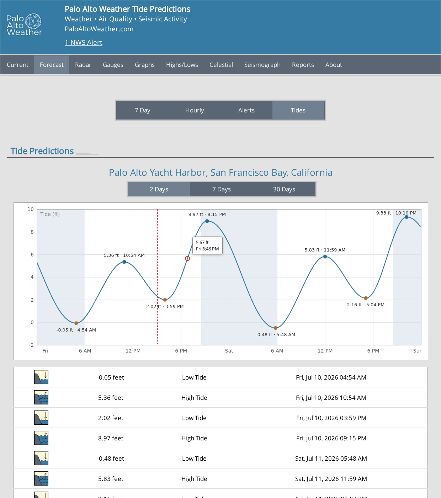
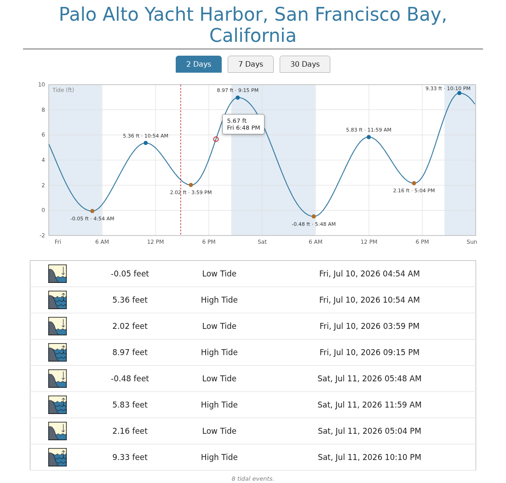

# weewx-xtide
Open source plugin for WeeWX software.

## Description

A WeeWX extension for XTide.  XTide is a package that provides tide and current predictions in a wide variety of formats.  With this extension, one can include high and low tide predictions for a given location in reports.

The bundled sample report is an interactive tide graph: continuous tide levels with the
high and low tides marked, tabs for 2-day, 7-day and 30-day views, night (sunset to
sunrise) shading, a "now" line, and click/hover anywhere on the curve to see the exact
time and tide level.  The tidal events for the selected view are listed below the graph.
The page is self-contained (no javascript libraries, nothing fetched at run time).

For more information about xtide (a package required to use this extension), see [flaterco.com's xtide page](https://flaterco.com/xtide/).

One can see this extension in action on [PaloAltoWeather.com](https://www.paloaltoweather.com/tides.html)



Copyright (C)2024-2026 by John A Kline (john@johnkline.com)

**This plugin requires Python 3.10, WeeWX 4 or 5**

# Installation Instructions

## build and install xtide and xtide data

1. Execute the following commands
   (It's probably easier to save this to a file and run as a script.)
   ```
   # Install dependencies
   sudo apt install build-essential libpng-dev

   # Download and install libtcd
   cd /tmp
   wget https://flaterco.com/files/xtide/libtcd-2.2.7-r2.tar.bz2
   tar xf libtcd-2.2.7-r2.tar.bz2
   cd libtcd-2.2.7
   ./configure
   make
   sudo make install
   sudo ldconfig

   # Download and build xtide
   cd /tmp
   wget https://flaterco.com/files/xtide/xtide-2.16.tar.xz
   tar xf xtide-2.16.tar.xz
   cd xtide-2.16
   ./configure --without-x --disable-shared CPPFLAGS="-I/usr/local/include" LDFLAGS="-L/usr/local/lib"
   make
   sudo make install

   # Download harmonics data
   cd /tmp
   wget https://flaterco.com/files/xtide/harmonics-dwf-20251228-free.tar.xz
   tar xf harmonics-dwf-20251228-free.tar.xz
   cd harmonics-dwf-20251228
   sudo mkdir -p /usr/local/share/xtide
   sudo cp harmonics-dwf-20251228-free.tcd /usr/local/share/xtide/

   # Create conf file
   echo "/usr/local/share/xtide" | sudo tee /etc/xtide.conf
   ```

1. Verify xtide works by running the following as the
   user that weewx runs under:
   ```
   /usr/local/bin/tide -l "Palo Alto Yacht Harbor"
   ```

## WeeWX 5 Installation Instructions

1. See above, make sure the tide program runs as the same user as weewx.  DO NOT PROCEED UNTIL YOU GET TIDE WORKING.

1. Activate the virtual environment (actual syntax varies by type of WeeWX install):
   ```
   . /home/weewx/weewx-venv/bin/activate
   ```

1. Download the release from the [github](https://github.com/chaunceygardiner/weewx-xtide).
   Click on releases and pick the latest release (Release v2.0).

1. Install the xtide extension.
   ```
   weectl extension install weewx-xtide.zip
   ```

1. Restart WeeWX.

# Configuring weewx-xtide

1. By default, xtide will request tides for Palo Alto Yacht Harbor, San Francisco Bay, California
   Change the location tag **under XTide** in weewx.conf to a location for which tidal data exists.
   Locations can be found at (https://flaterco.com/xtide/locations.html).
   ```
   [XTide]
    location = Palo Alto Yacht Harbor, San Francisco Bay, California
   ```

1. For legacy reasons, by default, this extension looks for the tide program at /usr/bin/tide, but if you followed the instructions above, the tide program
   will be at /usr/local/bin/tide.  You'll need to set the prog variable to point to it.
   ```
   [XTide]
    prog = /usr/local/bin/tide
   ```

1. By default, xtide will keep 7 days of tidal events in the database for use with
   $xtide.events() in your own reports.  One can change this in weewx.conf.  (The
   sample report's graph is not affected by this setting; it always shows 30 days.)
   ```
   [XTide]
    days = 7
   ```

1. Add XTideVariables to each report that you want to have access to tidal events.

   For example, to enable in the SeasonsReport, edit weewx.conf to add user.xtide.XTideVariables
   in search_list_extensions.  Note: you might need to add both the CheetahGenerator line and the
   search_list_extensions line (if they do no already exist).
   ```
    [StdReport]
        [[SeasonsReport]]
            [[[CheetahGenerator]]]
                search_list_extensions = user.xtide.XTideVariables
   ```

1. Restart WeeWX.

1. After the next reporting cycle, navigate to <weewx-html-directory>/xtide to see the
   tide graph in the sample report.  Note: the sample report runs the tide program itself
   at report time and always shows 30 days; the days setting only controls how many days
   of events are kept in the database for use with $xtide.events() in your own reports.

1.  To get tidal events (in this example, all tidal events are returned for the number of days specified in weewx.conf):
    ```
     #for event in $xtide.events()
         $event.location
         $event.dateTime
         $event.eventType
         $event.level
     #end for
    ```
    Sample values for the above variables follow:
    ```
    $event.location : Palo Alto Yacht Harbor, San Francisco Bay, California
    $event.dateTime : 2024-07-11 04:03:00 PDT
    $event.eventType: High Tide
    $event.level    : 6.34 feet
    ```
    A screenshot follows:

    

## Troubleshooting

1.  Can you successfully run the tide program as the weewx user?  If you can't do this, go no further until you resolve that.

1.  Did you forget to add XTideVariables to your report in weewx.conf?  See step 1 in the **Add XTideVariables to each report that you want to have access to tidal events.** section.

1.  The extension can be run from the command line to test:

    a. To test execution of the tide program from the weewx-xtide extension:

       Activate the virtual environment (if using WeeWX 5).
       In the following command line, make sure to set --prog to the location of the tide program
       ```
       PYTHONPATH=/home/weewx/bin python3 /home/weewx/bin/user/xtide.py --test-tide-execution --location "Palo Alto Yacht Harbor, San Francisco Bay, California" --prog /usr/local/bin/tide
       ```

    b. To test the service as a whole, requesting and saving to a [temporary] sqlite database:

       Activate the virtual environment (if using WeeWX 5).
       In the following command line, make sure to set --prog to the location of the tide program
       ```
       PYTHONPATH=/home/weewx/bin python bin/user/xtide.py --test-tide-execution --location "Palo Alto" --prog /usr/local/bin/tide
       ```
 
    c. To view tide forecast records in the database (only works for sqlite databases):

       Activate the virtual environment (if using WeeWX 5).
       In the following command line, make sure to set --prog to the location of the tide program
       ```
       PYTHONPATH=/home/weewx/bin python3 /home/weewx/bin/user/xtide.py --view-events --xtide-database /home/weewx/archive/xtide.sdb
       ```

    d. To see all options:
       ```
       PYTHONPATH=/home/weewx/bin python3 /home/weewx/bin/user/xtide.py --help
       ```
## Running the test suite

For those working on weewx-xtide itself: the repository includes a pytest test suite
covering the tide-output parser (both the 2.15 and 2.16 output formats), the error
handling, the graph geometry, and an end-to-end render of the sample report's template.
Most of the suite runs against fake tide executables, so results are deterministic and
both historical output formats get exercised (a modern tide can no longer produce the
2.15 format).  Integration tests then verify the REAL tide program (at
/usr/local/bin/tide, or set the XTIDE_PROG environment variable): these are worth
running after any xtide or harmonics upgrade.  A tide program that is missing, or that
is installed but not producing events, FAILS the suite — either one is an early signal
that the extension will not work in production.  From the repository root, using a Python
that has WeeWX and pytest installed (e.g., the WeeWX virtual environment):
```
python -m pytest tests
```

## Icons

Icons by [JChiaWorks](https://www.jchiaworks.com/)

## Licensing

weewx-xtide is licensed under the GNU Public License v3.
