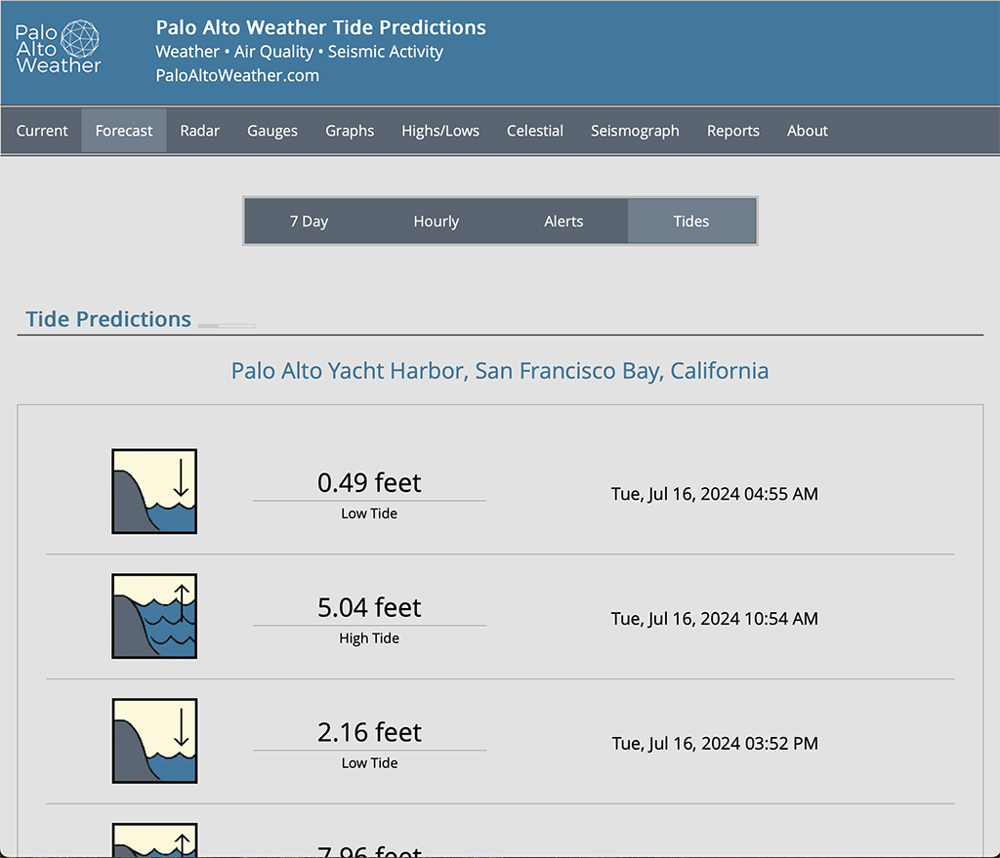
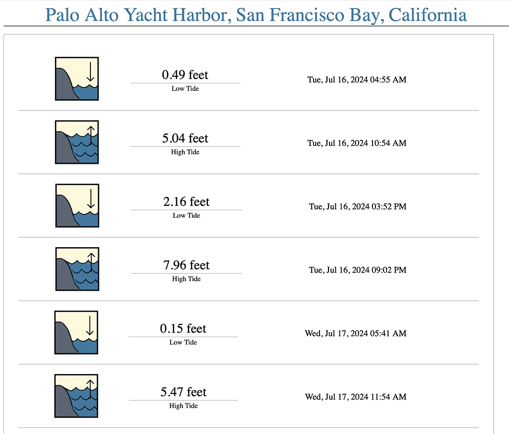

# weewx-xtide
Open source plugin for WeeWX software.

## Description

A WeeWX extension for XTide.  XTide is a package that provides tide and current predictions in a wide variety of formats.  With this extension, one can include high and low tide predictions for a given location in reports.

For more information about xtide (a package required to use this extension), see [flaterco.com's xtide page](https://flaterco.com/xtide/).

One can see this extension in action on [PaloAltoWeather.com](https://www.paloaltoweather.com/forecast.html?tab=tides)



Copyright (C)2024 by John A Kline (john@johnkline.com)

**This plugin requires Python 3.7, WeeWX 4 or 5**

# Installation Instructions

## Install xtide

1. If available in your unix distro, install xtide:
  ```
  sudo apt-get install xtide
  ```

1. Install xtide-data
   ```
   sudo apt install xtide-data
   sudo apt install xtide-coastline
   sudo apt install xtide-data-nonfree
   ```

1. Verify xtide works by running the following as the
   user that weewx runs under:
   ```
   /usr/bin/tide -l "Palo Alto Yacht Harbor"
   ```

## Alternately, if xtide is not avaiable on your unix distro

Note: the following steps have worked for the author of this extension.  Having said that,
support for building the xtide package is not available from this author.  Ask the xtide community.


1. Change to your home directory and set the mode on your home directory
   so that the weewx user can find the tide program.
   ```
   cd
   chmod 755
   ```

1. Get the xtide package.
   ```
   cd
   wget https://flaterco.com/files/xtide/xtide-2.15.5.tar.xz
   unxz xtide-2.15.5.tar.xz
   tar -xvf xtide-2.15.5.tar
   ```

1. Install some xtide prerequisites
   ```
   sudo apt-get install libpng-dev
   sudo apt-get install libtcd-dev
   ```

1. Configure and build xtide
   ```
   cd ~/xtide-2.15.5
   ./configure --with-x=no
   make tide
   ```

1. Install xtide-data
   ```
   sudo apt install xtide-data
   sudo apt install xtide-coastline
   sudo apt install xtide-data-nonfree
   ```

1. Create the file /etc/xtide.conf with the location of harmonic data.  As root, use your favorite editor to create the /etc/xtide.conf file with the following contents:
   ```
   /usr/share/xtide
   ```

1. Verify xtide works by running the following as the user that weewx runs under:
   ```
   /home/<username>/xtide-2.15.5/tide -l "Palo Alto Yacht Harbor"
   ```

1. Follow the instructions below to install weewx-xtide.  DO NOT FORGET to set the prog variable in weewx.conf to point to the tide program that you built.  You need to do this because xtide is not in the standard place.  Rather, it is under your home directory.
   ```
   [XTide]
    prog = /home/<username/xtide-2.15.5/xtide
   ```

## WeeWX 5 Installation Instructions

1. See above, make sure the tide program runs as the same user as weewx.  DO NOT PROCEED UNTIL YOU GET TIDE WORKING.

1. Activate the virtual environment (actual syntax varies by type of WeeWX install):
   ```
   . /home/weewx/weewx-venv/bin/activate
   ```

1. Install the dateutil package.
   ```
   pip install python-dateutil
   ```

1. Download the release from the [github](https://github.com/chaunceygardiner/weewx-xtide).
   Click on releases and pick the latest release (Release v1.0.4).

1. Install the xtide extension.
   ```
   weectl extension install weewx-xtide-1.0.4.zip
   ```

## WeeWX 4 Installation Instructions

1. See above, make sure the tide program runs as the same user as weewx.  DO NOT PROCEED
   UNTIL YOU GET TIDE WORKING.

1. Install dateutil for python3 (it is required by the nws extension).
   On debian, this can be accomplished with:
   ```
   sudo apt install python3-dateutil
   ```

1. Download the release from the [github](https://github.com/chaunceygardiner/weewx-xtide).
   Click on releases and pick the latest release (Release v1.0.4).

1. Run the following command.
   ```
   sudo /home/weewx/bin/wee_extension --install weewx-xtide-1.0.4.zip
   ```
   Note: The above command assumes a WeeWX installation of `/home/weewx`.
         Adjust the command as necessary.

# Configuring weewx-xtide

1. By default, xtide will request tides for Palo Alto Yacht Harbor, San Francisco Bay, California
   Change the location tag **under XTide** in weewx.conf to a location for which tidal data exists.
   Locations can be found at (https://flaterco.com/xtide/locations.html).
   ```
   [XTide]
    location = Palo Alto Yacht Harbor, San Francisco Bay, California
   ```

1. By default, this extension looks for the tide program at /usr/bin/tide If you built xtide manually (because it is missing from you Linux distribution), you'll need to the `prog` entry to the location where the program resides.  You'll also need to make sure the user that weewx runs as can execute the tide program.
   ```
   [XTide]
    prog = /usr/bin/tide
   ```

1. By default, xtide will request 7 days of tide forecasts.  One can change this in weewx.conf.
   ```
   [XTide]
    days = 7
   ```

1. Add XTideVariables to each report that you want to have access to tidal events.

   For example, to enable in the SeasonsReport, edit weewx.conf to add user.xtide.XTidetVariables
   in search_list_extensions.  Note: you might need to add both the CheetahGenerator line and the
   search_list_extensions line (if they do no already exist).
   ```
    [StdReport]
        [[SeasonsReport]]
            [[[CheetahGenerator]]]
                search_list_extensions = user.xtide.XTideVariables
   ```

1. Restart WeeWX.

1. After the next reporting cycle, navigate to <weewx-html-directory>/xtide to see forecasted tides in the sample report.

1.  To get tidal events (in this example, all tidal events are returned for the numnber of days specified in weewx.conf):
    ```
     #for event in $xtide.events()
         $event.location
         $event.dateTime
         $event.eventType
         $event.level
     #end for
    ```
    Sample values for the above variables follow:
    ```
    $event.location : Palo Alto Yacht Harbor, San Francisco Bay, California
    $event.dateTime : 2024-07-11 04:03:00 PDT
    $event.eventType: High Tide
    $event.level    : 6.34 feet
    ```
    A screenshot follows:

    

## Troubleshooting

1.  Can you successfully run the tide program as the weewx user?  If you can't do this, go no further until you resolve that.

1.  Did you forget to add XTideVariables to your report in weewx.conf?  See step 1 in the **Add XTideVariables to each report that you want to have access to tidal events..** section.

1.  The extension can be run from the command line to test:

    a. To test execution of the tide program from the weewx-xtide extension:

       Activate the virtual environment (if using WeeWX 5).
       In the following commmand line, make sure to set --prog to the location of the tide program
       ```
       PYTHONPATH=/home/weewx/bin python3 /home/weewx/bin/user/xtide.py --test-tide-execution --location "Palo Alto Yacht Harbor, San Francisco Bay, California" --prog /home/jkline/software/xtide-2.15.5/tide
       ```

    b. To test the service as a whole, requesting and saving to a [temporary] sqlite database:

       Activate the virtual environment (if using WeeWX 5).
       In the following commmand line, make sure to set --prog to the location of the tide program
       ```
       PYTHONPATH=/home/weewx/bin python bin/user/xtide.py --test-tide-execution --location "Palo Alto" --prog /home/jkline/software/xtide-2.15.5/tide
       ```
 
    c. To view tide forecast records in the databse (only works for sqlite databases):

       Activate the virtual environment (if using WeeWX 5).
       In the following commmand line, make sure to set --prog to the location of the tide program
       ```
       PYTHONPATH=/home/weewx/bin python3 /home/weewx/bin/user/xtide.py --view-events --xtide-database /home/weewx/archive/xtide.sdb
       ```

    d. To see all options:
       ```
       PYTHONPATH=/home/weewx/bin python3 /home/weewx/bin/user/xtide.py --help
       ```
## Icons

Icons by Jessica Chia

## Licensing

weewx-xtide is licensed under the GNU Public License v3.
